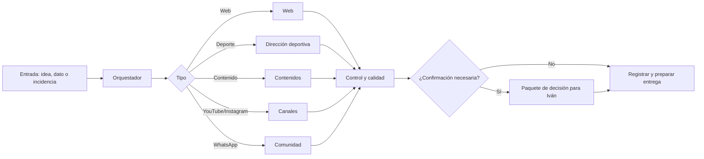

# Sistema operativo de agentes, Malibú FC

Estado: arquitectura propuesta para el proyecto Malibú FC, 2026-08-10.

## Criterio de separación

El sistema personal de agentes localizado en `Red de agentes personal Codex` contiene conectores y reglas útiles, pero su conector central de YouTube excluye expresamente `malibu_fc`. Por tanto, no se copia ni se reutiliza esa capa para Malibú FC. Este documento define una instancia independiente, compatible en principios, pero separada en datos, permisos, canales y decisiones.

## Agentes y responsabilidad

| Rol | Responsabilidad | Puede ejecutar sin confirmación | Requiere confirmación de Iván |
| --- | --- | --- | --- |
| Orquestador Malibú | Prioridad, dependencias, registro de decisiones y handoff | Preparar planes y documentación | Decisiones estratégicas y cambios de alcance |
| Web | HTML, CSS, JavaScript, responsive, SEO, GitHub Pages | Cambios locales reversibles y pruebas | Publicación de cambios públicos relevantes |
| Dirección deportiva | Plantillas, calendario, disponibilidad, convocatorias y asistencia | Borradores internos | Publicar datos de jugadores, convocatorias o resultados |
| Contenidos | Guiones, piezas, fotografías, notas y calendario editorial | Borradores y adaptaciones | Publicar cualquier pieza o dato no confirmado |
| YouTube | Canal, series, metadata, analítica y biblioteca | Lectura y preparación de borradores | Subir, publicar, editar o borrar |
| Instagram | Perfil, reels, carruseles, stories y archivo | Borradores, copies y planificación | Publicar o responder como marca |
| Comunidad WhatsApp | Estructura de grupos, etiquetas, encuestas y rutinas | Plantillas de mensajes | Cambios de administradores, expulsiones o mensajes sensibles |
| Control y calidad | Privacidad, fuentes, permisos, enlaces y QA | Revisiones y alertas | Cerrar bloqueos P0 o excepciones |

## Flujo operativo

## Reglas no negociables

- La fuente de verdad pública es este repositorio; los datos internos permanecen en sus herramientas privadas.
- Hecho, inferencia, borrador y placeholder se etiquetan por separado.
- Ningún agente inventa nombres, dorsales, fechas, resultados, precios, estadísticas, teléfonos, pagos o acuerdos comerciales.
- Las publicaciones son siempre una acción final de Iván o de un responsable autorizado.
- Las credenciales, tokens OAuth, exportaciones de hojas y datos personales quedan fuera de Git.
- YouTube Malibú FC utiliza su conector aislado `tools/youtube_malibu.py`, nunca el conector central excluyente.

## Cadencia mínima

- Diario, revisar entradas de WhatsApp de la cúpula, incidencias deportivas y tareas bloqueadas.
- Semanal, cerrar calendario editorial, revisar partidos y preparar contenidos.
- Por partido, registrar disponibilidad, convocatoria, resultado, fotos autorizadas y aprendizajes.
- Mensual, revisar métricas de web y redes, coste operativo, riesgos y backlog.

## Handoff obligatorio

Cada bloque se cierra indicando trabajo realizado, archivos afectados, decisiones incorporadas, pendientes de Iván, riesgos, pruebas y una única siguiente acción recomendada.
