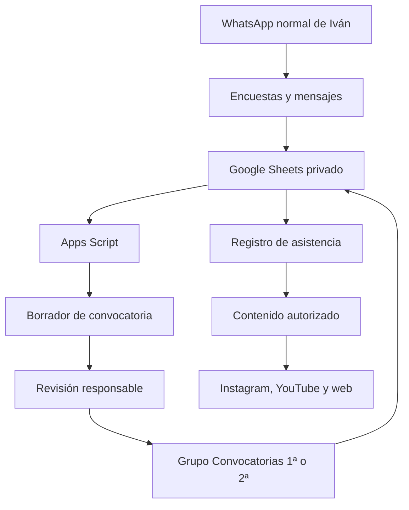

# Modelo operativo semanal, Malibú FC

Estado: procedimiento base para el primer y segundo equipo, 2026-08-10.

## 1. Arquitectura de trabajo

La web pública nunca consulta directamente la hoja de control. La hoja contiene los datos internos y Apps Script aplica validaciones y permisos. WhatsApp sirve para coordinar y confirmar; la hoja conserva el histórico.

## 2. Roles mínimos

| Rol | Responsabilidad semanal | Sustituto |
| --- | --- | --- |
| Dirección deportiva | decisiones entre equipos, excepciones y cierre | por asignar |
| Responsable primer equipo | encuesta, convocatoria y asistencia de primera | por asignar |
| Responsable segundo equipo | encuesta, convocatoria y asistencia de segunda | por asignar |
| Comunicación | fotos, textos, redes y web | por asignar |
| Administrador de datos | Sheets, Apps Script, copias y auditoría | Codex durante el piloto |

Cada equipo debe tener responsable y suplente. Nadie debe depender de una sola persona para cerrar una convocatoria.

## 3. Preparación única

1. Confirmar zona horaria de Google Sheets: `Atlantic/Canary`.
2. Confirmar usuarios y roles en `docs/malibu-control-system.md`.
3. Mantener una hoja privada con estas pestañas: `Inicio`, `Listas`, `Plantilla`, `Eventos`, `Disponibilidad`, `Convocatorias`, `Asistencia`, `Resumen jugadores`, `Dashboard` y `Mensajes y uso`.
4. Definir `teamId` fijo: `first` y `second`.
5. Crear una fila de evento antes de abrir cada encuesta.
6. Preparar en WhatsApp mensajes guardados para disponibilidad, cierre, convocatoria, cambio y asistencia.
7. Probar un evento ficticio de cada equipo antes de usar datos reales.

## 4. Rutina semanal base

Los partidos se disputan entre el lunes y el jueves. La convocatoria de cada partido se cierra y se publica el sábado anterior. Después del sábado sólo se admiten cambios excepcionales, fechados y validados por la cúpula.

### Lunes, revisión y partidos

- Se ejecutan los partidos previstos para lunes, si los hay.
- El responsable registra cambios, asistencia e incidencias del evento.
- Si procede, se publica el contenido autorizado del partido anterior.

### Martes, planificación de la siguiente jornada

- Responsables confirman partidos de lunes a jueves, rival, campo y hora.
- Se crean los eventos de `first` y `second` en Sheets.
- Se comprueba que cada evento tiene responsable y hora límite de respuesta.
- Se cierran en Sheets los eventos ya celebrados.

### Miércoles, apertura de disponibilidad

- Se publica en `Convocatorias 1ª` la encuesta del primer equipo.
- Se publica en `Convocatorias 2ª` la encuesta del segundo equipo.
- El mensaje incluye evento, fecha, hora límite y respuestas permitidas: `sí`, `no`, `duda`.
- No se solicitan diagnósticos ni información médica en el grupo.

### Jueves, seguimiento y partidos

- El responsable revisa no respuestas y dudas.
- Se envía un recordatorio sólo a quienes no han respondido, si es posible sin exponer datos.
- Las incidencias se resumen en la cúpula con el formato `EQUIPO · HECHO · IMPACTO · ACCIÓN · RESPONSABLE`.
- Apps Script recalcula disponibles, no disponibles, dudas y déficit.
- Se registran asistencia y cambios de los partidos celebrados.

### Viernes, cierre de datos y validación

- Se cierra la encuesta a la hora definida.
- Se revisan elegibilidad, duplicados, bajas y cupo.
- Se genera el borrador de convocatoria para cada equipo.
- Dirección deportiva valida excepciones.
- Se prepara el mensaje final para publicar el sábado.

### Sábado, cierre de convocatorias

- Dirección deportiva aprueba las convocatorias de ambos equipos.
- El responsable publica la convocatoria final en `Convocatorias 1ª` y `Convocatorias 2ª`.
- Se fija la hora de citación y se solicita confirmación de recepción.
- La hoja cambia el evento a `callup_published` y conserva quién aprobó y cuándo.
- Desde este momento sólo se aceptan sustituciones o cambios excepcionales, siempre registrados.

### Domingo, recordatorio logístico

- Se envía un recordatorio breve de hora, campo, equipación y transporte cuando aplique.
- No se reabre la encuesta salvo decisión expresa de la cúpula.

### Día de partido, lunes a jueves

- Se registran cambios de última hora en la cúpula.
- Se evita editar mensajes antiguos sin dejar una corrección fechada.
- El responsable registra llegada, asistencia y cualquier incidencia operativa.
- Comunicación captura material sólo con autorización.

### Día posterior al partido

- Se cierra asistencia y resultado en Sheets.
- Se calculan indicadores sin mezclar equipos.
- Se prepara, si procede, un resultado para la web, un reel, stories y un borrador de YouTube.
- Todo dato público requiere confirmación antes de publicar.

## 5. Plantillas de WhatsApp

### Apertura de disponibilidad

`[DISPONIBILIDAD · 1ª/2ª] Partido contra [RIVAL], [DÍA] a las [HORA], en [CAMPO]. Responde a la encuesta antes de [LÍMITE]. Si tienes una limitación horaria, indícala por privado al responsable.`

### Convocatoria

`[CONVOCATORIA · 1ª/2ª] Partido contra [RIVAL], [DÍA] [HORA], [CAMPO]. Citación: [HORA]. Convocados: [LISTA AUTORIZADA]. Reservas: [LISTA]. Confirmen recepción en la encuesta o al responsable.`

### Cambio

`[CAMBIO · 1ª/2ª] Se modifica [DATO] del evento [EVENTO]. Nuevo dato: [VALOR]. Responsable: [NOMBRE]. Actualizado: [FECHA Y HORA CANARIAS].`

## 6. Reglas de datos y privacidad

- La hoja es privada y no se publica en GitHub ni se enlaza desde la web.
- Teléfonos, observaciones médicas, disciplina y conflictos sólo se registran si son imprescindibles y con acceso restringido.
- Las convocatorias públicas sólo se publican con nombres y fotografías autorizados.
- El grupo no sustituye al histórico: cada decisión se registra en Sheets.
- No se automatiza WhatsApp normal mediante scraping, sesiones clonadas o bots no oficiales.

## 7. Indicadores semanales

- porcentaje de respuestas por equipo,
- no respuestas antes del cierre,
- disponibilidad positiva,
- convocados y reservas,
- confirmaciones,
- asistencia, retrasos y ausencias justificadas,
- cambios de última hora,
- errores detectados,
- tiempo entre cierre y convocatoria,
- piezas de contenido producidas y publicadas.

Los porcentajes deben mostrar siempre numerador, denominador, equipo y periodo.

## 8. Cierre de semana

El domingo o lunes se archiva un resumen breve: partidos celebrados, convocatorias cerradas, incidencias abiertas, datos que faltan, contenidos publicados, decisiones de la cúpula y tres prioridades de la siguiente semana.

## 9. Primera semana de implantación

1. Confirmar responsables y suplentes.
2. Confirmar zona horaria y catálogos de la hoja.
3. Crear un evento de prueba para cada equipo.
4. Ejecutar encuestas y generar borradores sin publicar datos reales.
5. Revisar permisos y mensajes.
6. Ejecutar el primer ciclo real con revisión manual.
7. Registrar errores y ajustar tiempos antes de automatizar más.
