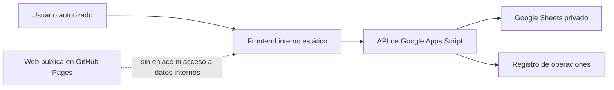

# Sistema de control deportivo Malibú FC

Fecha de diagnóstico: 2026-07-29.

## Propósito y alcance

El sistema debe coordinar plantilla, eventos, disponibilidad, convocatorias, asistencia, altas o pruebas y equipaciones para dos equipos, con una interfaz interna usable desde móvil. La web pública y el sistema interno son productos separados: comparten repositorio y criterios de diseño, pero no datos, permisos ni navegación pública.

La fuente operativa confirmada es la hoja privada de Google Sheets titulada `Sistema de control de asistencia y convocatorias Malibú FC 2026-27`. El Excel local es una copia privada de referencia y no debe modificarse ni incorporarse a Git. El identificador de la hoja se configurará exclusivamente en Google Apps Script mediante propiedades del proyecto.

## Diagnóstico de la situación actual

El libro contiene once hojas: Inicio, Listas, Plantilla, Altas y pruebas, Eventos, Disponibilidad, Convocatorias, Asistencia, Resumen jugadores, Dashboard y Mensajes y uso.

La estructura cubre el flujo operativo principal y dispone de listas controladas, fórmulas de resumen, mensajes de WhatsApp y reglas de gobierno. La carga actual consta de 28 personas en Plantilla, 23 jugadores y 5 perfiles de dirección deportiva, y 7 registros en Altas y pruebas. No existen todavía eventos ni registros operativos de disponibilidad, convocatoria o asistencia. Por tanto, los indicadores históricos están a cero y no permiten validar tasas, tendencias ni conciliaciones.

La auditoría se ha realizado en modo lectura sobre el Excel y Google Sheets. No se ha modificado la fuente original ni se han copiado nombres, observaciones, teléfonos u otros datos personales al repositorio.

### Fortalezas

- Identificadores únicos y sin duplicados en Plantilla y Altas y pruebas.
- Separación funcional entre maestros, eventos y hechos operativos.
- Validaciones desplegables para los estados principales.
- Fórmulas de control para respuestas, disponibles, convocados, asistentes y déficit.
- Regla explícita de una fila por persona y evento.
- Dashboard inicial y mensajes operativos de WhatsApp.

### Incidencias y brechas

| Severidad | Hallazgo | Impacto | Tratamiento |
|---|---|---|---|
| Crítica | Google Sheets usa `America/Los_Angeles` como zona horaria | Fechas límite y marcas de tiempo pueden desplazarse respecto a Canarias | Confirmar y cambiar a `Atlantic/Canary` antes de usar la API |
| Alta | Eventos y tablas de hechos no tienen registros reales | No se puede probar el ciclo completo ni validar indicadores | Ejecutar piloto con datos autorizados después de aprobar el modelo |
| Alta | El libro contiene datos personales, observaciones internas, disponibilidad, asistencia e incidencias | No puede publicarse ni consumirse directamente desde GitHub Pages | Mantener la hoja privada y mediar todo acceso mediante API autenticada |
| Alta | No existe modelo de permisos ni autenticación implantado | Una URL de Apps Script no constituye control de acceso | Definir usuarios, roles y política de despliegue antes de fase 2 |
| Media | Estados y nombres de campos no coinciden entre el libro actual y el modelo objetivo | Riesgo de reglas inconsistentes en frontend, API y hoja | Aprobar catálogo canónico y crear mapeo de migración |
| Media | Resumen jugadores duplica nombre, equipo y renovación | Riesgo de divergencia con Plantilla | Convertirlo en vista derivada por ID |
| Media | Las fórmulas usan rangos máximos fijos, hasta filas 100, 203 o 1003 | Los datos futuros pueden quedar fuera de los cálculos sin aviso | Sustituir por rangos dinámicos o cálculos de API |
| Media | El dashboard no filtra por temporada, periodo ni tipo de evento | Indicadores poco auditables cuando haya histórico | Incorporar filtros y definiciones de métricas |
| Media | Equipaciones está repartido entre Plantilla y Altas y pruebas | No existe trazabilidad de entrega, devolución o estado | Crear entidad Kits independiente |
| Media | Altas y pruebas mezcla estado, categoría y decisión | El embudo de captación no tiene semántica única | Normalizar Recruitment con estados de flujo |
| Baja | La mayoría de jugadores tiene posición sin definir | Limita la preparación deportiva de convocatorias | Completar la posición antes del piloto |
| Baja | Teléfono está vacío en la copia revisada | No afecta al modelo y evita una exposición adicional | Mantenerlo fuera del API salvo necesidad aprobada |

Los rangos con fórmulas vacías no se consideran registros. Los porcentajes actuales son valores estructurales, no evidencia de rendimiento.

## Arquitectura objetivo



El frontend no conocerá el identificador de la hoja, no ejecutará consultas directas a Sheets y no contendrá credenciales. `src/control/api.js` será la única capa que conoce el contrato HTTP. En fase 1 utiliza datos simulados. En fase 2 se configurará una URL de Apps Script después de aprobar autenticación, permisos y política de despliegue.

Google Sheets seguirá siendo el almacenamiento operativo mientras el volumen, concurrencia y criticidad lo permitan. Apps Script concentrará validaciones, autorización, transformación de datos, control de concurrencia y auditoría. Esta separación permite migrar posteriormente el almacenamiento sin rehacer la interfaz.

## Usuarios y permisos propuestos

| Rol | Consulta | Registra disponibilidad | Prepara convocatoria | Registra asistencia | Administra maestros |
|---|---:|---:|---:|---:|---:|
| Jugador | Solo eventos y datos propios | Sí, propia | No | No | No |
| Responsable de equipo | Equipo asignado | Sí, por excepción | Sí | Sí | No |
| Dirección deportiva | Ambos equipos | Sí | Sí | Sí | Plantilla y captación |
| Administrador | Todo | Sí | Sí | Sí | Sí |

La asignación nominal de roles, suplencias y ámbito por equipo queda pendiente. Las observaciones sensibles, incidencias médicas o disciplinarias requieren permisos más restrictivos y una política de retención específica.

## Flujos funcionales

### Evento y disponibilidad

1. Una persona autorizada crea el evento con equipo, fecha, hora, lugar, límite de respuesta y objetivo.
2. El sistema abre disponibilidad y muestra el evento únicamente a las personas elegibles.
3. Cada jugador registra disponible, no disponible o duda, con limitación opcional.
4. El responsable cierra respuestas y revisa faltantes y déficit.

### Convocatoria

1. El responsable parte de la disponibilidad cerrada.
2. Selecciona convocados y reservas, asigna rol y, si procede, orden de reserva.
3. El sistema valida duplicados, elegibilidad, cupo objetivo y excepciones.
4. La convocatoria se publica y cada jugador confirma o rechaza.
5. Toda modificación posterior queda fechada y atribuida.

### Asistencia

1. El responsable abre el registro para un evento cerrado o en curso.
2. Registra asistencia, retraso, ausencia justificada o no justificada.
3. Añade minutos, titularidad e incidencia solo cuando corresponda.
4. Cierra la asistencia en un plazo operativo por confirmar.
5. El dashboard recalcula métricas con denominadores explícitos.

### Altas, pruebas y equipación

Captación y equipación se gestionarán como módulos independientes. La incorporación de un candidato a Plantilla debe mantener el identificador de origen y crear un nuevo `playerId`; no se copiarán observaciones privadas sin criterio de necesidad. Las entregas de equipación tendrán estado, fechas y responsable.

## Contrato de API

Versión inicial: `/v1`.

| Método | Ruta | Uso |
|---|---|---|
| GET | `/v1/dashboard` | Indicadores según filtros autorizados |
| GET | `/v1/players` | Plantilla visible para el rol |
| GET | `/v1/events` | Lista de eventos |
| POST | `/v1/events` | Crear evento |
| PUT | `/v1/events/{eventId}` | Actualizar evento |
| GET | `/v1/events/{eventId}/availability` | Consultar disponibilidad |
| POST | `/v1/events/{eventId}/availability` | Crear o actualizar respuesta |
| GET | `/v1/events/{eventId}/callups` | Consultar convocatoria |
| POST | `/v1/events/{eventId}/callups` | Guardar borrador o publicación |
| GET | `/v1/events/{eventId}/attendance` | Consultar asistencia |
| POST | `/v1/events/{eventId}/attendance` | Crear o actualizar asistencia |

Respuesta correcta:

```json
{
  "ok": true,
  "data": {},
  "meta": {
    "apiVersion": "v1",
    "timestamp": "2026-07-29T18:00:00+01:00"
  }
}
```

Respuesta de error:

```json
{
  "ok": false,
  "error": {
    "code": "VALIDATION_ERROR",
    "message": "Datos no válidos",
    "details": []
  },
  "meta": {
    "apiVersion": "v1"
  }
}
```

La API utilizará códigos estables, validará el rol en servidor y no devolverá campos privados por defecto. Las actualizaciones serán idempotentes por clave natural y deberán incluir control de versión o fecha de actualización para evitar sobrescrituras.

## Indicadores y definiciones mínimas

El dashboard debe filtrar por temporada, periodo, equipo y tipo de evento. Como mínimo mostrará jugadores activos y elegibles, eventos, tasa de respuesta, disponibilidad positiva, convocados, confirmaciones, asistentes, retrasos, ausencias, déficit de convocatoria y distribución por estado.

Cada tasa deberá publicar numerador y denominador. Una convocatoria contará únicamente cuando la decisión sea `called_up`; una asistencia positiva será `present` o `late`; una ausencia justificada no se mezclará con una ausencia no justificada.

## Fases

### Fase 1, aprobable sin datos privados

- Documentación funcional y modelo canónico.
- Frontend mobile first con datos simulados.
- Dashboard, eventos, registro de disponibilidad y preparación de convocatoria.
- Filtro por equipo.
- Capa API aislada y Apps Script modular preparado, sin despliegue.
- Repositorio sin Excel, secretos ni datos personales.

### Fase 2, integración controlada

- Corregir zona horaria y aprobar catálogos.
- Definir usuarios, roles, autenticación, permisos y retención.
- Migrar la hoja al modelo canónico con copia de seguridad.
- Implantar endpoints, validaciones, auditoría y bloqueo de concurrencia.
- Pilotar con un equipo y datos autorizados.

### Fase 3, operación y mejora

- Incorporar asistencia, captación, equipaciones e indicadores históricos.
- Automatizar avisos que tengan responsable y beneficio medible.
- Revisar trimestralmente volumen, errores, privacidad y umbral de migración.

## Criterios de aceptación de fase 1

La fase queda aceptada cuando el frontend funciona sin backend, solo presenta datos sintéticos, permite recorrer los cuatro flujos principales en móvil y escritorio, no modifica la web pública, no contiene secretos ni identificadores operativos, y todos los riesgos o decisiones pendientes están trazados en este documento y en `docs/BACKLOG.md`.
