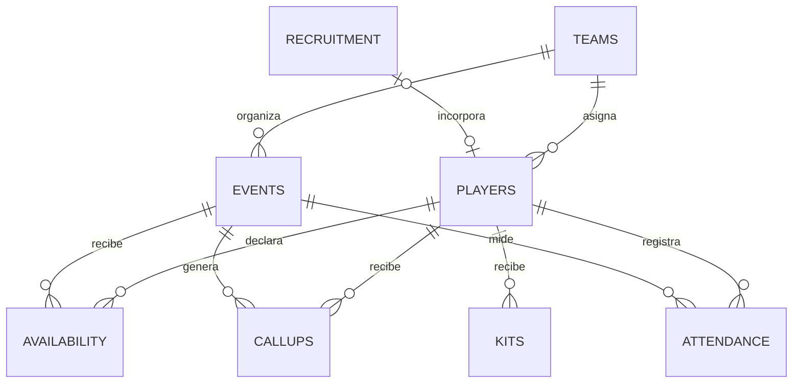

# Modelo de datos del sistema de control Malibú FC

Fecha de propuesta: 2026-07-29. Estado: pendiente de aprobación funcional y migración.

## Criterios de diseño

El modelo utiliza identificadores estables, una fila por entidad o hecho, fechas ISO 8601 y catálogos canónicos en inglés para la API. Google Sheets puede mostrar etiquetas en español, pero no debe alterar los valores internos sin una migración versionada.

Los nombres son atributos de presentación, nunca claves. Las relaciones se resuelven por ID. Los campos calculados no se almacenan junto a los hechos salvo que exista una razón de auditoría. Las tablas de resumen y el dashboard son vistas derivadas.

Clasificación:

- Pública: puede publicarse con autorización.
- Interna: acceso limitado al equipo autorizado.
- Restringida: requiere necesidad funcional, permisos específicos y retención definida.

## Relaciones

## Entidades canónicas

### Players

Clave primaria: `playerId`. Fuente actual: Plantilla.

| Campo | Tipo | Obligatorio | Clasificación | Regla |
|---|---|---:|---|---|
| `playerId` | string | Sí | Interna | Único, inmutable, patrón `P-0001` |
| `displayName` | string | Sí | Interna | Nombre operativo autorizado |
| `alias` | string | No | Interna | No puede ser clave |
| `personType` | enum | Sí | Interna | `player`, `sport_management`, `staff` |
| `position` | enum | Sí | Interna | `goalkeeper`, `defender`, `midfielder`, `forward`, `versatile`, `staff`, `undefined` |
| `renewalStatus` | enum | Sí | Restringida | `in`, `conditional`, `pending`, `out` |
| `eligibleFirst` | boolean | Sí | Interna | Elegibilidad para primer equipo |
| `eligibleSecond` | boolean | Sí | Interna | Elegibilidad para segundo equipo |
| `baseTeamId` | string | No | Interna | FK a Teams; nulo si no asignado |
| `usualAvailability` | enum | No | Interna | `high`, `medium`, `low`, `unknown` |
| `sportStatus` | enum | Sí | Restringida | `active`, `injured`, `suspended`, `inactive` |
| `callupActive` | boolean | Sí | Interna | Incluye en flujos de convocatoria |
| `startDate` | date | Sí | Interna | Alta efectiva |
| `endDate` | date | No | Interna | Debe ser posterior a `startDate` |
| `phone` | string | No | Restringida | No devolver al frontend salvo necesidad aprobada |
| `shirtNumber` | integer | No | Interna | Único por equipo y temporada si se aplica |
| `size` | enum | No | Restringida | Catálogo de tallas aprobado |
| `imageConsent` | enum | Sí | Restringida | `granted`, `denied`, `pending`, `not_applicable` |
| `notes` | string | No | Restringida | Evitar datos médicos o disciplinarios sin política específica |
| `createdAt` | datetime | Sí | Interna | Generado por servidor |
| `updatedAt` | datetime | Sí | Interna | Generado por servidor |

El libro actual no contiene alias, disponibilidad habitual, estado deportivo, fechas ni consentimiento de imagen. `Activo convocatorias` no sustituye el estado deportivo.

### Teams

Clave primaria: `teamId`. Entidad nueva.

| Campo | Tipo | Obligatorio | Regla |
|---|---|---:|---|
| `teamId` | string | Sí | `first`, `second` |
| `displayName` | string | Sí | Etiqueta aprobada |
| `seasonId` | string | Sí | FK a Seasons |
| `active` | boolean | Sí | Estado operativo |

`mixed` y `both` no son equipos. Son ámbitos de asignación o evento y se representarán mediante relaciones con ambos equipos.

### Events

Clave primaria: `eventId`. Fuente actual: Eventos.

| Campo | Tipo | Obligatorio | Clasificación | Regla |
|---|---|---:|---|---|
| `eventId` | string | Sí | Interna | Único e inmutable |
| `seasonId` | string | Sí | Interna | FK a Seasons |
| `weekOrRound` | string | No | Interna | Texto controlado |
| `eventType` | enum | Sí | Interna | `match`, `training`, `friendly`, `meeting`, `other` |
| `teamIds` | string[] | Sí | Interna | Uno o ambos equipos |
| `startAt` | datetime | Sí | Interna | Zona `Atlantic/Canary` |
| `opponentOrDescription` | string | Sí | Interna | Rival o descripción |
| `location` | string | No | Interna | Lugar operativo |
| `responseDeadline` | datetime | Sí | Interna | Anterior a `startAt` |
| `callupTarget` | integer | No | Interna | Mayor que cero cuando proceda |
| `status` | enum | Sí | Interna | `draft`, `availability_open`, `availability_closed`, `callup_draft`, `callup_published`, `completed`, `cancelled` |
| `ownerUserId` | string | Sí | Interna | FK a Users |
| `notes` | string | No | Restringida | Solo necesidad operativa |
| `createdAt` | datetime | Sí | Interna | Servidor |
| `updatedAt` | datetime | Sí | Interna | Servidor |

El estado actual `Planificado, Abierto, Cerrado, Cancelado` no distingue disponibilidad, convocatoria y cierre. Debe migrarse mediante tabla de correspondencias aprobada.

### Availability

Clave natural: `eventId + playerId`. Fuente actual: Disponibilidad.

| Campo | Tipo | Obligatorio | Clasificación | Regla |
|---|---|---:|---|---|
| `eventId` | string | Sí | Interna | FK a Events |
| `playerId` | string | Sí | Interna | FK a Players |
| `availabilityStatus` | enum | Sí | Interna | `available`, `unavailable`, `doubt`, `no_response` |
| `timeConstraint` | string | No | Restringida | Franja o limitación |
| `reason` | string | No | Restringida | No exigir diagnóstico médico |
| `reportedByUserId` | string | Sí | Interna | Usuario que registra |
| `respondedAt` | datetime | Sí | Interna | Servidor |
| `updatedAt` | datetime | Sí | Interna | Servidor |

La API realizará `upsert` por clave natural y conservará auditoría de cambios. Nombre y equipo no se almacenan en esta tabla; se obtienen por relación.

### Callups

Clave natural: `eventId + playerId`. Fuente actual: Convocatorias.

| Campo | Tipo | Obligatorio | Clasificación | Regla |
|---|---|---:|---|---|
| `eventId` | string | Sí | Interna | FK a Events |
| `playerId` | string | Sí | Interna | FK a Players |
| `decision` | enum | Sí | Restringida | `called_up`, `reserve`, `not_called`, `pending` |
| `role` | enum | No | Interna | `starter`, `substitute`, `goalkeeper`, `management`, `staff` |
| `reserveOrder` | integer | No | Interna | Obligatorio para reservas |
| `confirmation` | enum | Sí | Interna | `yes`, `no`, `pending` |
| `meetingAt` | datetime | No | Interna | Citación |
| `notifiedAt` | datetime | No | Interna | Sustituye al simple Sí/No |
| `nonCallupReason` | string | No | Restringida | Solo si es necesario |
| `calledByUserId` | string | Sí | Interna | FK a Users |
| `calledAt` | datetime | Sí | Interna | Publicación o cambio |
| `updatedAt` | datetime | Sí | Interna | Servidor |

La disponibilidad declarada no se duplica en esta entidad; se consulta en Availability. Las decisiones publicadas deben conservar historial.

### Attendance

Clave natural: `eventId + playerId`. Fuente actual: Asistencia.

| Campo | Tipo | Obligatorio | Clasificación | Regla |
|---|---|---:|---|---|
| `eventId` | string | Sí | Interna | FK a Events |
| `playerId` | string | Sí | Interna | FK a Players |
| `attendanceStatus` | enum | Sí | Restringida | `present`, `late`, `justified_absence`, `unjustified_absence`, `not_called` |
| `starter` | boolean | No | Interna | Aplicable a partido |
| `minutes` | integer | No | Interna | Entre 0 y duración del evento |
| `arrivalAt` | datetime | No | Restringida | Aplicable a retraso |
| `delayMinutes` | integer | No | Restringida | No negativo |
| `absenceReason` | string | No | Restringida | Mínimo necesario |
| `incidentType` | enum | No | Restringida | `none`, `injury`, `sanction`, `equipment`, `discipline`, `other` |
| `incidentDetail` | string | No | Restringida | Permiso específico |
| `registeredByUserId` | string | Sí | Interna | FK a Users |
| `registeredAt` | datetime | Sí | Interna | Servidor |
| `updatedAt` | datetime | Sí | Interna | Servidor |

`Sí, No, Tarde, Justificada, No convocado` se migrará a estados inequívocos. Un incidente de lesión no debe incluir diagnóstico en una hoja de acceso general.

### Recruitment

Clave primaria: `candidateId`. Fuente actual: Altas y pruebas.

| Campo | Tipo | Obligatorio | Clasificación | Regla |
|---|---|---:|---|---|
| `candidateId` | string | Sí | Restringida | Único |
| `displayName` | string | Sí | Restringida | Acceso limitado |
| `alias` | string | No | Restringida | Opcional |
| `category` | enum | Sí | Interna | `signing`, `trial`, `watchlist` |
| `pipelineStatus` | enum | Sí | Restringida | `identified`, `contacted`, `trial_scheduled`, `under_review`, `accepted`, `rejected`, `withdrawn` |
| `targetTeamIds` | string[] | No | Interna | Uno o ambos equipos |
| `position` | enum | Sí | Interna | Catálogo de Players |
| `source` | string | No | Restringida | Evitar terceros innecesarios |
| `contactDate` | date | No | Restringida | Fecha, sin detalle de contacto |
| `trialAt` | datetime | No | Restringida | Si está programada |
| `decision` | enum | Sí | Restringida | `incorporate`, `trial`, `pending`, `reject` |
| `needsKit` | boolean | Sí | Interna | Deriva una tarea, no una entrega |
| `ownerUserId` | string | Sí | Interna | FK a Users |
| `notes` | string | No | Restringida | Retención limitada |
| `createdAt` | datetime | Sí | Interna | Servidor |
| `updatedAt` | datetime | Sí | Interna | Servidor |

El libro actual presenta combinaciones no previstas por sus propias listas de validación en el campo Responsable. La API debe validar por `userId`, no por texto libre.

### Kits

Clave primaria: `kitAssignmentId`. Entidad nueva.

| Campo | Tipo | Obligatorio | Clasificación | Regla |
|---|---|---:|---|---|
| `kitAssignmentId` | string | Sí | Interna | Único |
| `playerId` | string | Sí | Interna | FK a Players |
| `seasonId` | string | Sí | Interna | FK a Seasons |
| `shirtNumber` | integer | No | Interna | Regla de unicidad por equipo |
| `size` | enum | Sí | Restringida | Catálogo aprobado |
| `source` | string | No | Interna | Pedido o procedencia |
| `status` | enum | Sí | Interna | `pending`, `ordered`, `received`, `delivered`, `returned`, `lost` |
| `deliveredAt` | datetime | No | Interna | Obligatorio si entregado |
| `returnedAt` | datetime | No | Interna | Posterior a entrega |
| `ownerUserId` | string | Sí | Interna | FK a Users |
| `notes` | string | No | Restringida | Opcional |
| `updatedAt` | datetime | Sí | Interna | Servidor |

### Seasons, Users y AuditLog

Estas entidades son necesarias para robustez, aunque no existen en el libro actual.

`Seasons` define `seasonId`, etiqueta, fecha de inicio, fecha de fin y estado. `Users` define `userId`, cuenta autorizada, rol, equipos y estado, sin almacenar contraseñas. `AuditLog` registra `operationId`, usuario, acción, entidad, ID, fecha, resultado y campos modificados; no copia el contenido completo de campos restringidos.

## Correspondencia con el libro actual

| Hoja actual | Destino | Tratamiento |
|---|---|---|
| Listas | Catálogos | Sustituir etiquetas por códigos canónicos y conservar presentación en español |
| Plantilla | Players | Añadir campos ausentes y separar Kits |
| Altas y pruebas | Recruitment | Normalizar categoría, estado y decisión |
| Eventos | Events | Unificar fecha y hora, ampliar estados y eliminar métricas almacenadas |
| Disponibilidad | Availability | Mantener clave compuesta, eliminar nombre y equipo duplicados |
| Convocatorias | Callups | Eliminar disponibilidad duplicada, añadir orden, motivos y fechas |
| Asistencia | Attendance | Normalizar estados, añadir titularidad y fecha de actualización |
| Resumen jugadores | Vista derivada | Sustituir atributos copiados por relaciones a Players |
| Dashboard | Vista derivada | Añadir filtros y definiciones de métricas |
| Mensajes y uso | Procedimiento | Mantener plantillas sin datos personales |
| Inicio | Gobierno operativo | Trasladar reglas estables a documentación |

## Reglas de integridad

1. Los IDs son únicos, inmutables y no se reutilizan.
2. Toda FK debe existir y estar activa o admitir explícitamente histórico.
3. Availability, Callups y Attendance admiten una fila vigente por evento y jugador.
4. Un evento cancelado no admite nuevas respuestas.
5. Una convocatoria solo puede publicarse después de cerrar disponibilidad, salvo excepción auditada.
6. La asistencia no puede registrarse para un evento futuro.
7. Las fechas se guardan como ISO 8601 y se interpretan en `Atlantic/Canary`.
8. Los campos de servidor no son editables desde el cliente.
9. Las métricas se calculan desde hechos, no desde celdas duplicadas.
10. Toda escritura incluye usuario, fecha y resultado de validación.

## Privacidad y exposición

Ninguna de estas tablas es pública por defecto. La API debe aplicar selección explícita de campos por endpoint y rol. Los teléfonos, observaciones, motivos, incidencias, captación, estados deportivos y asistencia se consideran restringidos. El identificador de la hoja no es una credencial y no sustituye autenticación; aun así, no debe incluirse en frontend, documentación pública ni archivos de entorno versionados.

## Migración propuesta

1. Crear copia de seguridad fechada del libro y congelar cambios durante la migración.
2. Confirmar zona horaria, catálogos, responsables y reglas de retención.
3. Añadir Sheets nuevas para Teams, Seasons, Users, Kits y AuditLog.
4. Transformar IDs y catálogos mediante un script reproducible con informe de excepciones.
5. Validar unicidad, obligatorios, FKs, fechas y conteos antes y después.
6. Ejecutar un piloto con datos autorizados y conciliación manual.
7. Activar la API solo después de aprobar autenticación y permisos.
